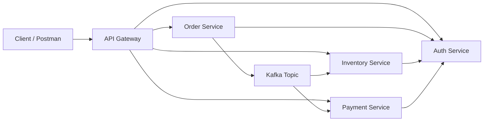

# Architecture Overview

## How to explain it in interviews

- The client talks to one gateway instead of calling each service directly.
- The gateway validates JWT tokens before forwarding requests.
- The order service triggers the workflow for inventory and payment.
- Kafka helps decouple the services for asynchronous events.
- Eureka provides service discovery for the platform.
